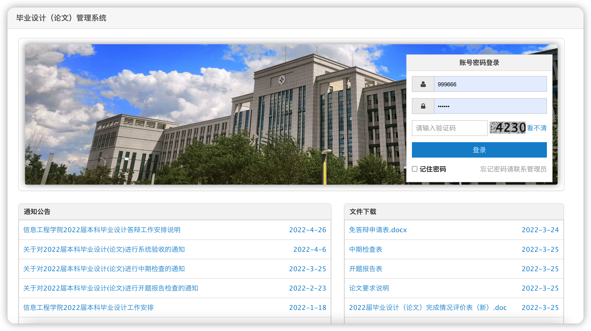
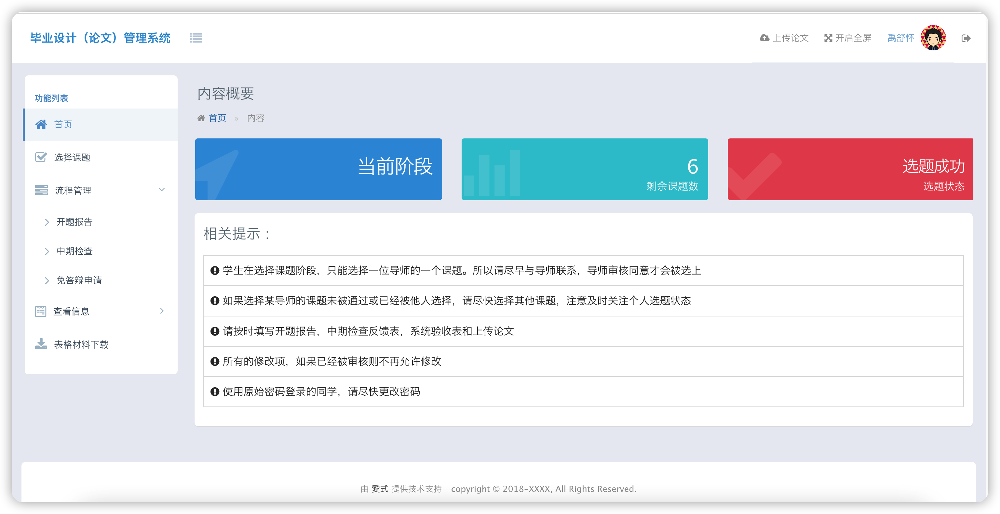
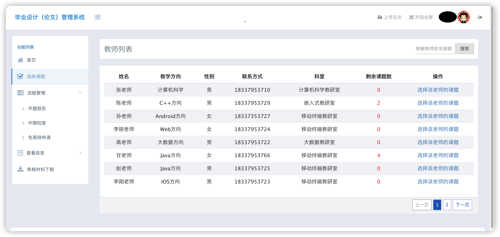
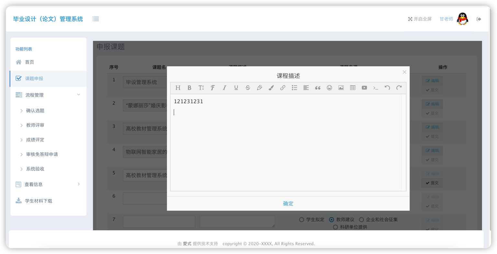
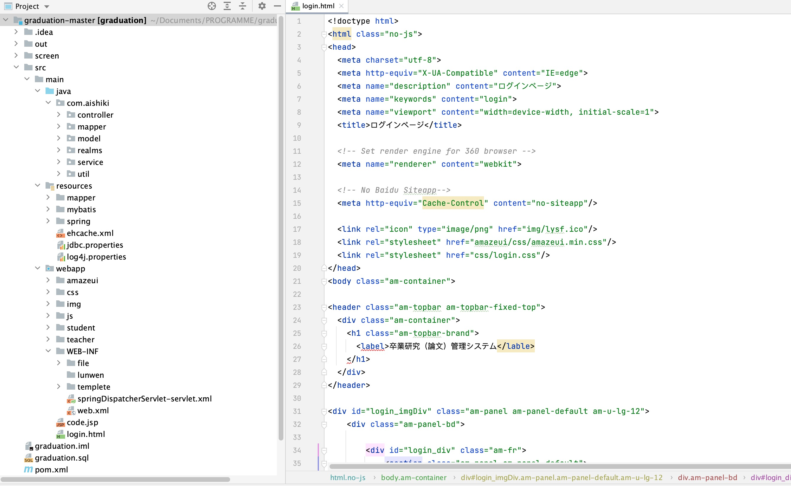

# Management system
The graduation project management system can be divided into five modules: Login Module, Topic Selection Module, Information Management Module, Process Management Module, and File Management Module.

Technically, the system uses the Spring+SpringMVC+MyBatis integration framework for backend development, and AmazeUI for frontend development. It also uses Ehcache for project caching, druid as the project's database connection pool, FreeMarker to export Word documents, and Shiro for login authentication. The database used is MySQL.
The system can be divided into two types of roles: Student and Teacher.
The frontend interface is implemented in pure HTML, and all interactions with the backend are completed via Ajax.
## Login Module
The Login Module primarily handles the login functionality for teacher and student users, with each role seeing a different interface upon logging in.
## Topic Selection Module
The Topic Selection Module primarily handles the process of teachers and students mutually selecting topics.
## Information Management Module
The Information Management Module primarily handles CRUD operations for various types of information.
## Process Management Module
The Process Management Module primarily handles the management of the thesis proposal report, mid-term check, thesis defense exemption application, acceptance/defense, and thesis review processes.
## File Management Module
The File Management Module primarily manages file uploads and downloads.

## Some Interfaces
- Login (Both students and teachers use this login interface to log in)

- Home Page (The home page displays some content summaries and related prompts)

- Teacher List (By selecting a teacher, one can then choose their topic)

- Topic Declaration (Teachers can only declare a topic after filling in the topic name)# Management-system

- Project structure

# Management-system
